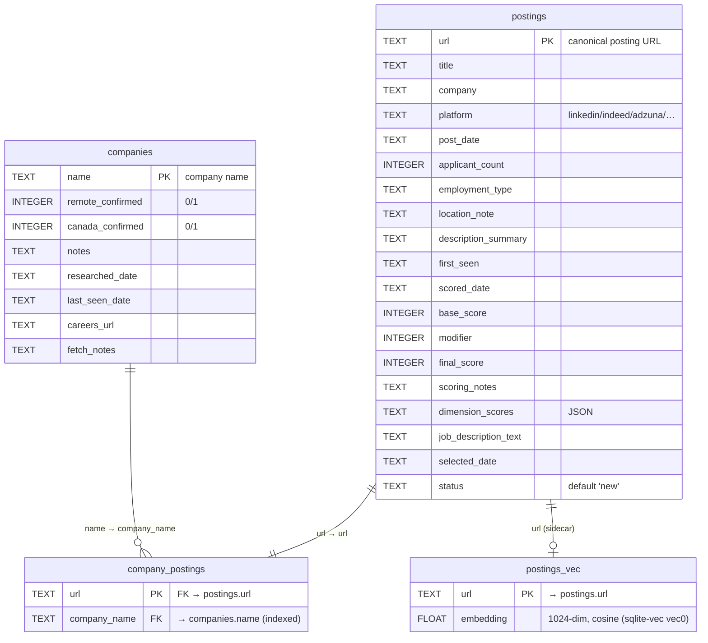

# Database Schema

The harness uses a single SQLite database located by the **`HARNESS_DB`** env var
(a path straight to the file). If `HARNESS_DB` is unset it falls back to the
historical `$JOB_DATA_ROOT/jobs/postings.db`. Decoupling the DB path from
`JOB_DATA_ROOT` lets `JOB_DATA_ROOT` itself be a per-user, DB-stored config value.

Core tables:
- **`postings`** — one row per job posting URL; tracks the full scoring/selection/application lifecycle.
- **`companies`** — one row per hiring company; persists research findings and remote/Canada confirmation across pipeline runs.
- **`company_postings`** — links each posting to its hiring company (1 company : N postings).

Multi-user configuration tables (spec 12, phase 1) — see
[the section below](#multi-user-configuration-tables):
- **`users`**, **`config_items`** / **`user_config_items`**, **`sources`** /
  **`user_sources`**, **`prefilter_rules`** / **`user_prefilter_rules`**,
  **`scoring_modifier_blocks`** / **`user_scoring_modifiers`**,
  **`target_role_items`** / **`user_target_roles`**.

Plus one vector sidecar:
- **`postings_vec`** — a [sqlite-vec](https://github.com/asg017/sqlite-vec) virtual table holding a 1024-dim embedding per posting (keyed by URL, cosine distance), created and loaded by `make_engine`. Powers semantic repost-dedup and score-reuse; see [embeddings.md](embeddings.md).

## Diagram



Each posting links to exactly one company through `company_postings` (`url` is that table's primary key), and a company can own many postings — so the company-to-posting relationship is **1 : N**. `postings_vec` is a parallel virtual table keyed by the same `url`; it carries no SQL foreign key but is kept in lock-step with `postings` by the application layer.

> **Editing diagrams?** After changing any mermaid diagram in `docs/` (a ```mermaid block in a `.md` file, or a standalone `.mmd` file), validate it with `nox -s docs_mermaid` from the repo root. It runs the official `mermaid-cli` parser in Docker against every diagram and fails on the first syntax error, so a pass means the diagrams render on GitHub. Requires Docker.

## Table: `postings`

One row per job posting URL. The URL is the natural primary key — duplicate inserts are silently ignored (`INSERT OR IGNORE`).

```sql
CREATE TABLE postings (
    url                  TEXT     PRIMARY KEY,
    title                TEXT,
    company              TEXT,
    platform             TEXT,
    post_date            TEXT,
    applicant_count      INTEGER,
    employment_type      TEXT,
    location_note        TEXT,
    description_summary  TEXT,
    first_seen           TEXT,
    scored_date          TEXT,
    base_score           INTEGER,
    modifier             INTEGER,
    final_score          INTEGER,
    scoring_notes        TEXT,
    dimension_scores     TEXT,
    job_description_text TEXT,
    selected_date        TEXT,
    status               TEXT     DEFAULT 'new'
)
```

### Columns

#### Identity

| Column | Type | Description |
|--------|------|-------------|
| `url` | TEXT PK | Canonical job posting URL. Primary key; duplicates are ignored on insert. |
| `title` | TEXT | Job title as listed on the posting. |
| `company` | TEXT | Hiring company name. |
| `platform` | TEXT | Source platform: `linkedin`, `indeed`, `adzuna`, `ziprecruiter`, `greenhouse`, `lever`, `ashby`, `workable`, `recruitee`, `remotive`, `himalayas`, `wwr`, `research`. |

#### Posting metadata

| Column | Type | Description |
|--------|------|-------------|
| `post_date` | TEXT | ISO 8601 date the posting was published. Used to calculate the age modifier. NULL if not available. |
| `applicant_count` | INTEGER | Number of applicants at time of discovery. Used to calculate the competition modifier. NULL if not available. |
| `employment_type` | TEXT | e.g. `full-time`, `contract`, `freelance`. NULL if not listed. |
| `location_note` | TEXT | Free-text location eligibility note from the search result, e.g. `"Remote, Canada OK"`. |
| `description_summary` | TEXT | 2–3 sentence summary of the role written by the seeker agent at discovery time. Used for soft-skill pre-filtering. |

#### Pipeline tracking

| Column | Type | Description |
|--------|------|-------------|
| `first_seen` | TEXT | ISO 8601 date the row was first inserted. |
| `status` | TEXT | Lifecycle status. Default `new`. See [job-states.md](job-states.md). |
| `selected_date` | TEXT | ISO 8601 date `job-preparer` marked this posting `selected`. NULL until then. |

#### Scoring

| Column | Type | Description |
|--------|------|-------------|
| `scored_date` | TEXT | ISO 8601 date scoring last ran. A posting with `scored_date` older than 7 days is re-scored on the next run. |
| `base_score` | INTEGER | Weighted composite score (1–100) before modifiers. Calculated from 5 dimensions (see below). |
| `modifier` | INTEGER | Total modifier applied (sum of disqualifier + age + competition adjustments). May be negative. |
| `final_score` | INTEGER | `clamp(base_score + modifier, 1, 100)`. The value used for ranking and selection. |
| `scoring_notes` | TEXT | Human-readable explanation of the score: dimension breakdown, disqualifiers triggered, modifiers applied. |
| `dimension_scores` | TEXT | JSON object with per-dimension scores (each 1–10, multiplied by weight to reach `base_score`). |
| `job_description_text` | TEXT | Full JD text (first 8 000 chars, HTML stripped). Cached on first score to avoid re-fetching. |

### `dimension_scores` JSON structure

```json
{
  "technical_fit":          8,
  "seniority_match":        7,
  "domain_fit":             6,
  "remote_canada_confirmed": 10,
  "role_clarity":           8
}
```

Weights used when computing `base_score`:

| Dimension | Weight |
|-----------|--------|
| `technical_fit` | 35% |
| `seniority_match` | 25% |
| `domain_fit` | 20% |
| `remote_canada_confirmed` | 10% |
| `role_clarity` | 10% |

`base_score = (Σ dimension × weight) × 10`, resulting in a 1–100 integer.

### Scoring modifiers

The `modifier` field is the sum of independent adjustments computed during scoring by the `scoring_module` script (which runs the rubric above on `claude-haiku-4-5`).

**Disqualifier modifiers** (applied by the scorer LLM during scoring; sum if several match). These are **user-configurable** — they live in the `scoring_modifiers` section of `$JOB_DATA_ROOT/disqualifiers.yaml`, not hard-coded. They are distinct from the pre-filter (which marks postings `skipped` *before* scoring; see [job-states.md](job-states.md)). The shipped defaults are:

| Condition (default name) | Modifier |
|--------------------------|----------|
| Requires a named formal certification (AWS Certified, PMP, CISSP, CKA, …) | −40 |
| Requires on-site or relocation | −30 |
| Geography excludes Canada (US-only) | −25 |
| None | 0 |

**Age modifier** (based on `post_date`):

| Post age | Modifier |
|----------|----------|
| ≤ 3 days | +8 |
| 4–7 days | +4 |
| 8–14 days | 0 |
| 15–30 days | −5 |
| > 30 days | −12 |
| Unknown | 0 |

**Competition modifier** (based on `applicant_count`):

| Applicant count | Modifier |
|-----------------|----------|
| < 25 | +5 |
| 25–100 | 0 |
| 101–200 | −5 |
| > 200 | −10 |
| Unknown | 0 |

**Fetch-failure modifier** (applied in code when the full JD cannot be retrieved):

| Condition | Modifier |
|-----------|----------|
| Full JD could not be fetched — posting scored from its short `description_summary` instead | −5 |

---

## Table: `companies`

One row per hiring company name. Populated during the **Seek** stage: each searcher runs `harness-db companies seen --platform <p> FILE...` (library `harness_db.companies`), which upserts every company in its batch using a per-platform flag policy — remote/Canada ratchets, `last_seen_date` advance, and `notes` fill-if-empty (or overwrite from the research agent's `company_notes`). `consolidate_module` also creates any missing row (name + `last_seen_date`) when a posting is first inserted. `job-seeker-company` later fills `careers_url` / `fetch_notes`. Read by `job-preparer` when assembling the context it passes to each `resume-tailor` / `cover-letter-creator` agent.

> Note: `scoring_module` — used both for the main-pipeline batch (driven by `job-preparer`) and for the single-posting "Score" action in the TUI/web (`--url`) — updates the `postings` row **and** ratchets this table's `remote_confirmed` / `canada_confirmed` / `last_seen_date` flags; see below.

```sql
CREATE TABLE companies (
    name               TEXT     PRIMARY KEY,
    remote_confirmed   INTEGER  DEFAULT 0,
    canada_confirmed   INTEGER  DEFAULT 0,
    notes              TEXT,
    researched_date    TEXT,
    last_seen_date     TEXT,
    careers_url        TEXT,
    fetch_notes        TEXT
)
```

### Columns

| Column | Type | Description |
|--------|------|-------------|
| `name` | TEXT PK | Company name as it appears in job postings. Primary key. |
| `remote_confirmed` | INTEGER | `1` if any verified posting or research confirmed the company offers fully remote work; `0` otherwise. Never downgraded — once confirmed, stays confirmed. |
| `canada_confirmed` | INTEGER | `1` if any verified posting or research confirmed Canada-eligibility; `0` otherwise. Never downgraded. |
| `notes` | TEXT | 1–2 sentence research summary: funding stage, domain focus, team size, hiring signals. The ATS/board searchers fill a default "Hiring on {board}" note when empty; `job-seeker-research` overwrites it from each posting's `company_notes`. |
| `researched_date` | TEXT | ISO 8601 date `job-seeker-research` last upserted this company (stamped by the `research` flag policy). |
| `last_seen_date` | TEXT | ISO 8601 date any pipeline stage last encountered a posting from this company. Advanced by `harness-db companies seen` / `consolidate_module` during Seek and by `scoring_module` on every scoring run. |
| `careers_url` | TEXT | At least one URL to where the company posts its jobs (careers page or ATS board). Written by `job-seeker-company`. NULL until researched. |
| `fetch_notes` | TEXT | Notes on how to fetch jobs and job descriptions from the company's site (ATS type, API endpoint, pagination), or the reason the careers URL could not be found. Written by `job-seeker-company`. |

---

## Table: `company_postings`

Links each posting to its hiring company. One row per posting URL (`url` is the primary key), so the relationship is **1 company : N postings**. Written by `consolidate_module` in the same transaction that inserts the posting; the matching `companies` row is always inserted first (`INSERT … ON CONFLICT DO NOTHING`).

```sql
CREATE TABLE company_postings (
    url           TEXT     PRIMARY KEY REFERENCES postings(url),
    company_name  TEXT     REFERENCES companies(name)
)
```

| Column | Type | Description |
|--------|------|-------------|
| `url` | TEXT PK | Posting URL. Foreign key to `postings.url`. Primary key — each posting links to exactly one company. |
| `company_name` | TEXT | Hiring company name. Foreign key to `companies.name`. Indexed for company → postings lookups. |

### Writers and flag promotion rules

| Writer | What it writes | Conflict rule |
|--------|---------------|---------------|
| `consolidate_module` (Seek) | `name`, `last_seen_date` on first insert | `INSERT … ON CONFLICT DO NOTHING` — never overwrites an existing row |
| platform searchers (e.g. `job-seeker-adzuna`) | `canada_confirmed`, `last_seen_date` | Uses `MAX()` — flags only increase (0→1); `last_seen_date` advances to the newer date |
| `job-seeker-research` | `notes`, `remote_confirmed = 1`, `canada_confirmed = 1`, `researched_date` | Overwrites flags to 1; preserves existing notes if new notes are empty |
| `job-seeker-company` | `careers_url`, `fetch_notes` | Fills in research findings |
| `scoring_module` (every scoring run — batch and single-posting) | `remote_confirmed`, `canada_confirmed`, `last_seen_date` | Uses `MAX()` — flags can only increase (0→1), never decrease (1→0) |

### How `remote_confirmed` / `canada_confirmed` are set by `scoring_module`

> This applies to **all** scoring — the main-pipeline batch (`job-preparer`) and the single-posting "Score" action (`--url`) share the same write path.

The scorer's `remote_canada_confirmed` dimension is scored 1–10. If that dimension score is **≥ 8**, the posting explicitly states remote + Canada eligibility and both flags are set to `1` on upsert. Below 8, both are set to `0` in the upsert, but `MAX()` ensures an existing `1` is never overwritten.

### How `company_notes` flows to cover letters

```
job-seeker-research  →  companies.notes
                               ↓
job-preparer  (SELECT notes FROM companies WHERE name IN (...))
                               ↓
job-preparer  →  resume-tailor prompt + cover-letter-creator prompt
                  (company_notes passed inline when spawning each agent)
```

## Multi-user configuration tables

Phase 1 of the multi-user evolution (spec 12) makes all user-facing inputs
data-driven and per-user. The pattern is **catalog + per-user selection**: a
catalog table holds the available items (built-in rows have `owner_uid` NULL; a
user's custom additions carry their `uid`), and a `user_*` join table records
which a given user has enabled. This phase scopes **only configuration** —
`postings`/`companies`/scoring stay shared and unscoped.

All tables are SQLAlchemy 2.0 declarative models in
`harness-db/harness_db/models.py`, created via `Base.metadata.create_all` and
seeded/migrated by `harness_db.seed.ensure_schema_and_seed`.

| Table | Purpose |
|-------|---------|
| `users` | `uid` PK, `active` flag, `created_at`, `locale` (BCP-47 tag, FK to `locales.code`, default `en-US`). |
| `config_items` | Catalog of config keys: `JOB_DATA_ROOT`, `RESUME_FILE`, `ADZUNA_APP_ID`, `ADZUNA_API_KEY`, and the candidate-summary judgment fields `CANDIDATE_HEADLINE`, `CANDIDATE_NOTABLE`, `CANDIDATE_YEARS_EXPERIENCE`, `CANDIDATE_WORK_TYPE`, `CANDIDATE_ELIGIBILITY`, `CANDIDATE_EMPLOYMENT`, `CANDIDATE_COMP_FLOOR_CAD`. The language-neutral `name`/`description` are the en-US fallback for labels. |
| `user_config_items` | Per-user value for a config key (PK `uid`+`config_key`). |
| `locales` | Catalog of supported UI locales (spec 15): `code` PK (e.g. `en-US`), `name`, `active`. Seeded with `en-US`. |
| `config_item_labels` | Localized label + help text for a config key, per locale (spec 15). Composite PK `config_key`+`locale`; columns `label`, `help_text`. Seeded for `en-US` from each `config_items` row's `name`/`description`. |
| `sources` | Catalog of the 7 high-level search sources. |
| `user_sources` | Per-user enabled flag for a source. |
| `prefilter_rules` | Prefilter rule: `category` (one of the 4 disqualifier sections) + `value`; `owner_uid` NULL = built-in. |
| `user_prefilter_rules` | Per-user enabled flag for a prefilter rule. |
| `scoring_modifier_blocks` | Named scoring-modifier block: `name`, `modifier`, `examples` (JSON). |
| `user_scoring_modifiers` | Per-user enabled flag for a scoring block. |
| `target_role_items` | Target-role entry: `kind` (`title`/`keyword`/`domain`) + `value`. |
| `user_target_roles` | Per-user enabled flag for a target-role item. |

### Resolution & migration

- **Config values** resolve via `harness_db.config_store.get_config(key, uid)`:
  the user's DB value first, then the env var / `settings.local.json` fallback
  (so an un-migrated single-user install keeps working).
- **Sources / disqualifiers / target roles** read the active user's enabled rows
  (`harness_db.sources_store`, `harness_db.disqualifiers`,
  `harness_db.target_roles`), falling back to the legacy
  `disqualifiers.yaml` only when no DB exists.
- On first run `ensure_schema_and_seed` seeds the built-in catalogs, creates the
  `default` user with everything enabled, and **imports** any existing
  `sources-config.json`, `disqualifiers.yaml`, `target-roles.md`, and env config
  into that user — a one-time migration that never clobbers later UI edits.
- The **active user** is resolved CLI flag → `.active-user` dotfile (beside the
  DB file) → `default`.
- **Config labels** resolve via `harness_db.locales.get_labels(locale)`, falling
  back per key: the user's `locale` → `en-US` → the `config_items` `name`/
  `description` → the raw key. Each user's `locale` (`harness_db.locales`
  `get_user_locale`/`set_user_locale`) selects which labels the Settings → Config
  tab renders. `users.locale` is added to pre-existing DBs by a small idempotent
  `ALTER TABLE` in `ensure_schema_and_seed` (`create_all` only creates new
  *tables*, never new columns).

### Editing

Both front-ends edit these tables through the same shared libraries (TUI
**Settings** tab; web **Settings** tab), and the `harness-db` CLI exposes
`user`, `config`, `locales`, `sources`, `disqualifiers`, and `target-roles`
command groups. The TUI Settings → Config tab renders the active user's
localized labels/help text, and Settings → Profile lets the user pick a locale
(`harness-db user locale [CODE]`); the web UI's localization is deferred to the
future multi-tenant work.
