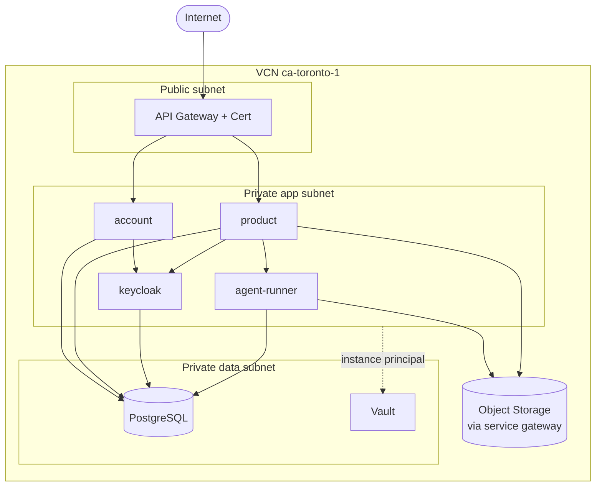

# Deployment on Oracle Cloud (OCI) — Spec 17

Cloud-first deployment design for the multi-tenant web app. Pairs with
[`multi-tenant-architecture.md`](./multi-tenant-architecture.md) (topology) and
[`specs/17-multi-tenant-web.md`](../specs/17-multi-tenant-web.md) (phasing). This
is a **plan to critique**, not provisioned infrastructure.

## 1. Principles

- **Everything in Terraform.** No click-ops. `terraform apply` from clean state
  yields a reachable HTTPS deployment.
- **Two distinct identity systems, don't conflate them.** *OCI IAM* secures the
  *infrastructure* (who can run Terraform, who can read Vault). *Keycloak*
  secures the *application* (who are our end users). They never mix.
- **v1 = OCI Container Instances, not Kubernetes** (D4). Fewer moving parts for a
  handful of services; OKE is the documented scale-up path (§6).
- **Secrets only from Vault.** Images and compose files carry none.
- **Region pinned for residency** — Canada-focused product → `ca-toronto-1`
  (with `ca-montreal-1` as DR/secondary). Confirm in review (open question 7).

## 2. OCI services used

| Concern | OCI service | Notes |
|---------|-------------|-------|
| Public entry / routing / JWT check | **API Gateway** | TLS termination, route to apps, validate OIDC JWT on protected routes, basic rate limiting |
| TLS certs | **OCI Certificates** | Managed certs for the gateway domain |
| Compute (apps) | **Container Instances** | `account`, `product`, `agent-runner`, `keycloak` as serverless containers (v1) |
| Image registry | **Container Registry (OCIR)** | Build → push → pull; same images as compose |
| Relational + vector store | **Database with PostgreSQL** (managed) | App DB **and** Keycloak DB (separate schemas/instances); `pgvector` extension |
| Secrets | **Vault** (+ KMS) | OIDC client secrets, social-app secrets, DB creds, platform Anthropic credential, SMTP creds |
| Transactional email | **Email Delivery** | SMTP relay for Keycloak magic-link + verification mail; approved sender + SPF/DKIM |
| Binary artifacts | **Object Storage** | Per-tenant prefixes: resumes, rendered PDFs, reports; pre-signed download URLs |
| Networking | **VCN** | Private subnets for data tier + apps; only the gateway is public |
| Identity (infra) | **OCI IAM** | Dynamic groups + policies for Terraform and instance principals reading Vault |
| Observability | **Logging + Monitoring** | App/gateway logs, metrics, alarms (error rate, quota, DB) |

## 3. Network shape



- Only the **API Gateway** is internet-facing. Apps live in a private subnet
  reachable only from the gateway; the data tier is reachable only from apps.
- Egress to OCI services (Object Storage, Vault) goes through a **service
  gateway**, not the public internet.
- Apps authenticate to Vault/Object Storage via **instance principals** (no
  long-lived keys in containers).

## 4. Terraform layout

```
infra/terraform/
  main.tf            providers, backend (state in Object Storage + lock)
  variables.tf       region, compartment, domain, image tags, sizing
  network/           VCN, subnets, gateways, security lists/NSGs
  registry/          OCIR repos
  database/          managed Postgres (app + keycloak), pgvector enable
  secrets/           Vault + KMS, secret definitions (values out-of-band)
  email/             Email Delivery approved sender, SMTP creds -> Vault
  storage/           Object Storage buckets + lifecycle, per-tenant prefixing
  identity/          OCI IAM dynamic groups + policies (instance principals)
  keycloak/          Container Instance + realm bootstrap (see 4.1)
  apps/              account, product, agent-runner container instances
  gateway/           API Gateway deployment, routes, JWT validation, certs
  observability/     log groups, metrics, alarms
  outputs.tf         gateway URL, issuer URL, bucket names
```

- **State** in an Object Storage backend with locking; never local.
- **Secret *values*** are never in `.tf`/state — Terraform creates the Vault
  secret *containers*; values are injected out-of-band (CI secret store or a
  one-time bootstrap), referenced by apps at runtime.
- **Image tags** are variables so a deploy is "build+push to OCIR, bump tag,
  apply."

### 4.1 Keycloak realm as code

The realm (clients, identity providers, the email/magic-link flow, required
email verification) is itself configuration we don't want to click together.
Options to decide in review:

- **Realm import JSON** baked into the Keycloak container / mounted at boot
  (simplest, version-controlled), **or**
- the **`keycloak` Terraform provider** managing realm/clients/IdPs as
  resources (more granular, more provider surface).

Either way: Google/GitHub/Facebook client ids/secrets come from **Vault**, and
the OIDC clients (`account`, `product`, gateway audience) are defined here.

## 5. Build & release

1. `build-images.sh` (exists for web today) extends to build `account`,
   `product`, `agent-runner`, and (if not using the upstream image) a themed
   `keycloak`.
2. Push to **OCIR** with an immutable tag (git sha).
3. Bump the image-tag variable; `terraform apply` rolls the Container Instances.
4. DB schema changes ship as **Alembic** migrations run as a one-shot job before
   the app rollout.

## 6. Scale-up path (not v1)

When Container Instances stop fitting (need rolling deploys, autoscaling,
service mesh, or many more services):

- Move apps to **OKE** (managed Kubernetes); keep managed Postgres, Vault,
  Email Delivery, Object Storage, API Gateway unchanged.
- The container images do not change — only their orchestration. This is why v1
  stays Container Instances: it does not paint us into a corner.

## 7. Local dev parity

`docker-compose` remains the inner loop and mirrors this topology with
stand-ins, so what runs locally is shaped like the cloud:

| Cloud | Local compose stand-in |
|-------|------------------------|
| API Gateway | a reverse proxy (Caddy/Traefik) or direct ports |
| Container Instances | the `account` / `product` / `agent-runner` services |
| Keycloak | the same Keycloak image, realm-import JSON |
| Managed Postgres + pgvector | `pgvector/pgvector` Postgres image |
| Email Delivery | Mailpit / MailHog (catch + view magic links) |
| Object Storage | MinIO (S3-compatible) or a bind-mounted dir |
| Vault | `.env` file (gitignored), like today's `settings.local.json` |

The crucial change from today's compose: **no host bind mount of
`~/.claude/.credentials.json` or `$JOB_DATA_ROOT`** — data is the `postgres`
service and Object Storage stand-in; the Anthropic credential is an env var the
`agent-runner` reads, matching the cloud's Vault-injected platform credential.

## 8. Cost & ops notes (for review)

- **Email Delivery** requires an approved sender + SPF/DKIM on the sending
  domain — lead time; set up early in Phase B.
- **Managed Postgres** is the main always-on cost; one instance with separate
  databases for app vs. Keycloak keeps it to a single bill at v1 scale.
- **Anthropic spend** is platform-borne (one credential) — the per-tenant quota
  in `agent-runner` (architecture §7) is the cost-control lever and must exist
  before public launch.
- **Backups**: managed Postgres automatic backups; Object Storage versioning on
  the outputs bucket.
