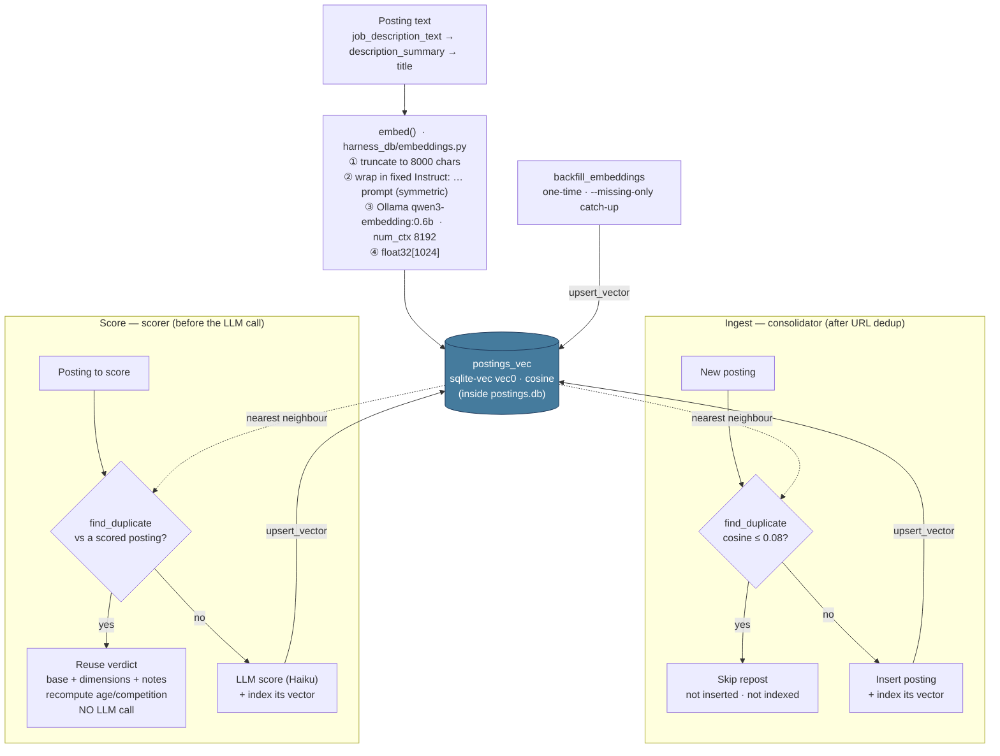

# Semantic Embeddings — dedup & similarity

The harness keeps a **vector index of every posting** alongside the relational
data. It powers two jobs in the pipeline:

- **Repost dedup** — the same job posted to several boards under different URLs
  is caught at ingest, so it enters the DB only once.
- **Score reuse** — a posting that near-duplicates an already-scored one reuses
  that verdict instead of paying for another LLM scoring call.

## What it is

| Piece | Detail |
|-------|--------|
| Model | Local [Ollama](https://ollama.com) `qwen3-embedding:0.6b`, 1024-dim. On-GPU; no API calls, no tokens. |
| Store | [sqlite-vec](https://github.com/asg017/sqlite-vec) virtual table `postings_vec`, **inside the same `postings.db`**, keyed by posting URL, cosine distance. No second datastore. |
| Code | `harness_db/embeddings.py` (embed), `harness_db/vectors.py` (`upsert_vector` / `nearest` / `find_duplicate`), loaded + table-created in `make_engine` (`harness_db/models.py`). |

The vector layer is a **required** part of the harness — see the
[README](../README.md) for the Python loadable-extension prerequisite, and
`3rdparty-install.sh`, which installs Ollama and pulls the model.

## How an embedding is produced

`embed(text)` in `harness_db/embeddings.py`:

1. Picks the richest text available for a posting: `job_description_text` →
   `description_summary` → `title`, then **truncates to 8000 chars**.
2. Wraps it in a fixed instruction (`Instruct: Represent this job posting …`).
   The **same wrapper is applied to both sides** of every comparison, which is
   what makes the cosine metric symmetric — the right property for "are these
   the same posting?" rather than asymmetric query→document retrieval.
3. Calls Ollama with `num_ctx = 8192` so a full truncated JD (~2300+ tokens)
   fits — Ollama's default context (~2048) is smaller than the model's true 32k
   and would otherwise 500 on long descriptions.
4. Returns the 1024-dim vector as `float32` bytes, stored/queried in
   `postings_vec`.

A near-duplicate is one whose nearest indexed neighbour is within
`DUPLICATE_DISTANCE` (cosine `0.08`). Postings with less than `_MIN_DEDUP_CHARS`
(200) of text skip semantic comparison — too little signal to trust.

## Where it fits in the workflow

The index is read at two decision points (ingest and scoring) and written
whenever a *new, canonical* posting is accepted. Reposts collapse onto the
canonical posting and are never indexed themselves. The one-time
`backfill_embeddings` populates vectors for postings that predate the feature
(`--missing-only` resumes / catches up cheaply).



## Tuning knobs

| Knob | Where | Default | Effect |
|------|-------|---------|--------|
| `DUPLICATE_DISTANCE` | `harness_db/vectors.py` | `0.08` | Cosine threshold for "same job". Raise (~0.12) to catch more aggressively-reworded reposts; lower to be stricter. |
| `_MIN_DEDUP_CHARS` | consolidator & scorer | `200` | Min posting text before semantic comparison runs. |
| `HARNESS_EMBED_MODEL` | env | `qwen3-embedding:0.6b` | Embedding model. **Changing it requires re-embedding the whole corpus** (`backfill_embeddings`) and matching `HARNESS_EMBED_DIM` + the `postings_vec` width — vectors from different models aren't comparable. |
| `HARNESS_EMBED_DIM` | env | `1024` | Vector width; must match the model. |
| `HARNESS_EMBED_NUM_CTX` | env | `8192` | Ollama context window for embedding. |

## Backfill

```bash
ollama pull qwen3-embedding:0.6b
python -m harness_db.backfill_embeddings                 # (re-)embed everything
python -m harness_db.backfill_embeddings --missing-only  # only postings not yet indexed
```

A full run re-embeds every posting (it doubles as the rebuild after switching
`HARNESS_EMBED_MODEL`); `--missing-only` skips postings already in
`postings_vec`, for resuming an interrupted run or catching up new rows.
