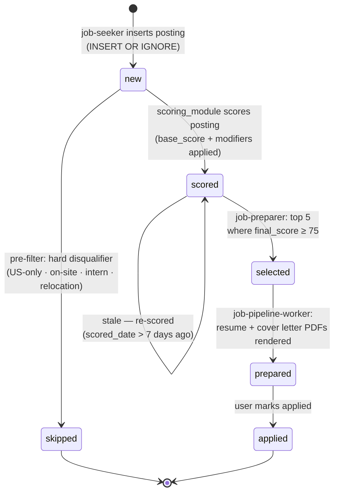

# Job Posting Lifecycle

The `status` column in the `postings` table tracks where each posting is in the pipeline.

## State Diagram

## States

| Status | Set By | Meaning | Next |
|--------|--------|---------|------|
| `new` | `job-seeker` (INSERT) | Posting freshly discovered; awaiting scoring. | `scored` or `skipped` |
| `scored` | `scoring_module` | Scored across 5 dimensions; all score fields populated. Eligible for selection. | `selected` (if top-5 ≥ 75) or stays `scored` |
| `skipped` | `job-preparer` pre-filter | Hard disqualifier detected before scoring — US-only, on-site, intern/entry-level, or relocation required. No further processing. | — (terminal) |
| `selected` | `job-preparer` | Chosen as a top-5 posting (final\_score ≥ 75). A pipeline task has been created. | `prepared` |
| `prepared` | `job-pipeline-worker` | Tailored resume and cover letter PDFs have been rendered. Ready for submission. | `applied` |
| `applied` | user (TUI `a` key) | Application has been submitted. | — (terminal) |

### Notes

- A posting that scores below 75 is **not** marked `skipped` — it remains `scored` and is simply not selected. It stays eligible if future runs have fewer high-scorers.
- A `scored` posting older than 7 days is re-queued for scoring on the next pipeline run. It stays in `scored` state but gets fresh scores before re-evaluation.
- `prepared` and `applied` postings are both excluded from the ranked candidate list in future pipeline runs.
