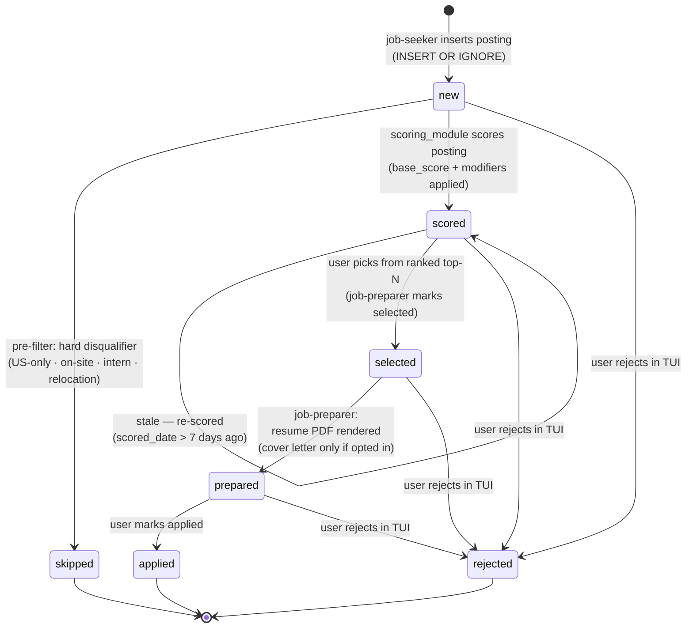

# Job Posting Lifecycle

The `status` column in the `postings` table tracks where each posting is in the pipeline.

## State Diagram

## States

| Status | Set By | Meaning | Next |
|--------|--------|---------|------|
| `new` | `job-seeker` (INSERT) | Posting freshly discovered; awaiting scoring. | `scored`, `skipped`, or `rejected` |
| `scored` | `scoring_module` | Scored across 5 dimensions; all score fields populated. Eligible for selection. | `selected` (user-chosen from the top-N, count set by the `JOB_TOP_N` config value, default 5), `rejected`, or stays `scored` |
| `skipped` | `job-preparer` pre-filter | Hard disqualifier detected before scoring — US-only, on-site, intern/entry-level, or relocation required. No further processing. | — (terminal) |
| `selected` | `job-preparer` | The user picked this posting from the ranked top-N (`final_score ≥ 75`); `job-preparer` marked it and queued it for preparation. | `prepared` or `rejected` |
| `prepared` | `job-preparer` | Tailored resume PDF rendered (and a cover letter PDF too, only if the user opted in — cover letters are off by default). Ready for submission. | `applied` or `rejected` |
| `applied` | user (TUI `a` key) | Application has been submitted. | — (terminal) |
| `rejected` | user (TUI `x` key) | User has decided not to apply. Reachable from `new`, `scored`, `selected`, or `prepared`. | — (terminal) |

### Notes

- Selection is **user-driven**: `job-preparer` returns the ranked top-N (postings with `final_score ≥ 75`; N is set by the `JOB_TOP_N` per-user config value (Settings → Config, env fallback), default 5) to the `job-search` skill, the user picks which to prepare, and only the chosen URLs are marked `selected`. A posting that scores below 75 is **not** marked `skipped` — it remains `scored` and is simply not offered. It stays eligible if future runs surface it again.
- The pre-filter actually runs in **two places**. At search time the `api_search` module drops matching postings (its `run()` for the API sources, and `append` when an MCP searcher merges its batch) so they never enter the DB (no row, no status) — the searcher agents do not apply the rules themselves. The `skipped` status is set only by `job-preparer`, which re-applies the same DB `prefilter` (via `harness-db prefilter`) to any rows that slipped through, before scoring.
- A `scored` posting older than 7 days is re-queued for scoring on the next pipeline run. It stays in `scored` state but gets fresh scores before re-evaluation.
- `selected`, `prepared`, and `applied` postings are all excluded from the ranked candidate list in future pipeline runs.
- `rejected` is a user-driven terminal state for postings the user has explicitly decided not to apply to, distinct from `skipped` (which is automatic pre-filter exclusion).
