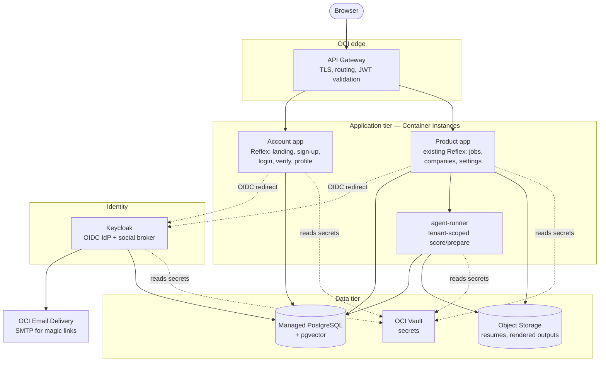
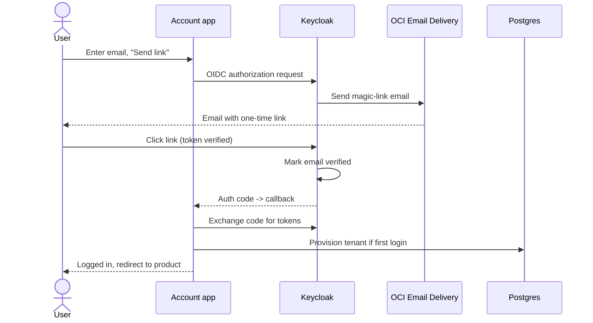
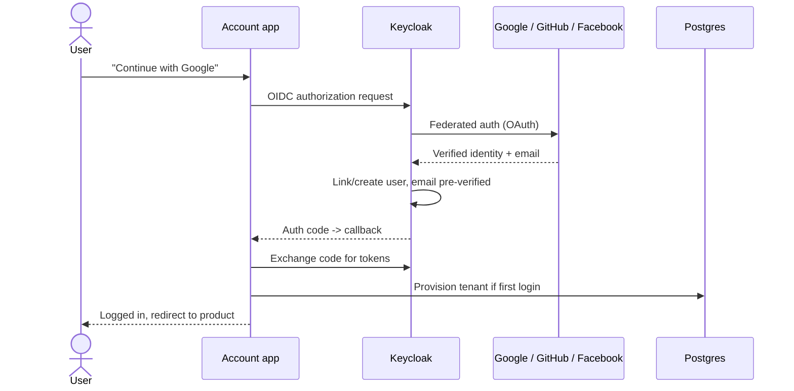

# Multi-Tenant Web Architecture — the *why* behind Spec 17

This is the design rationale for [`specs/17-multi-tenant-web.md`](../specs/17-multi-tenant-web.md).
The spec says *what* and *in what order*; this says *how* and *why*, and is the
document to argue with before any code is written. Deployment specifics live in
[`deployment-oci.md`](./deployment-oci.md).

## 1. Where we are starting from

The web app today is single-tenant to the bone, in ways that are easy to miss:

- `web/web/data.py` caches **one** SQLAlchemy engine for the whole process
  (`@lru_cache` over `make_engine(get_db_path())`). There is no notion of "who
  is asking" — every Reflex session reads and writes the same DB.
- `harness-db` (spec 12) made *configuration* per-user via a `uid`, but
  **postings, companies, and scoring are shared** and there is no auth: the
  active user is resolved from a CLI flag or a dotfile, not from a logged-in
  identity.
- The Docker story (`web/docker-compose.yml`) bind-mounts the host's
  `$JOB_DATA_ROOT` and `~/.claude/.credentials.json` into containers. That is a
  single-operator assumption baked into the deployment.
- `agent-runner` runs the `claude` CLI in **one** repo dir with **one** mounted
  credential. Every "Score"/"Prepare" click runs as the same identity against
  the same data.

Multi-tenancy has to be introduced at each of these four layers: identity, data
scoping, the data store itself, and the agent execution path.

## 2. Topology — the bifurcated web

We split the web into distinct deployables instead of bolting auth onto the one
Reflex app. Rationale: the public, unauthenticated identity surface has a
different threat model, scaling profile, and release cadence than the
authenticated product. Keeping them in one app would force the product app to
also be the thing exposed to anonymous traffic and OAuth callbacks.



### The pieces

- **API Gateway** is the single public entry. It terminates TLS, routes
  `/` + `/auth/*` to the account app and the product paths to the product app,
  and validates the OIDC access token (JWT) on protected routes so an
  unauthenticated request never reaches the product backend.
- **Account app** — a small new Reflex app: marketing landing, sign-up, login,
  email-verify landing, and account/profile management. It is an OIDC *relying
  party*: "Sign in" / "Sign up" redirect to Keycloak; the callback establishes a
  session and, on first login, **provisions the tenant** (see §4.4).
- **Product app** — the *existing* `web/` Reflex app (jobs / companies /
  settings), made into an OIDC relying party. It requires a session, resolves
  the tenant from the token, and scopes all data access. Unauthenticated hits
  bounce to the account app.
- **Shared design system** — a package (`web-ui/` or similar) holding the Radix
  theme, logo/brand assets, color mode, and common components, imported by both
  apps so they are visually one product. Today these live inside `web/web/`
  (`theme.py`, `/logo.svg`, `branding.md`); they get extracted, not copied.
- **Keycloak** — the OIDC IdP. Owns registration, the email magic-link flow,
  email verification, and brokering Google/GitHub/Facebook. Apps never see
  passwords or social tokens; they see a verified OIDC identity.
- **agent-runner** — keeps its job (isolate the `claude` CLI), but becomes
  tenant-aware (§7).
- **Data tier** — managed Postgres+pgvector (§5), Object Storage for binary
  artifacts (resumes, rendered PDFs), Vault for secrets.

### Why a separate account app rather than Keycloak's own pages?

Keycloak *can* host login/registration screens directly (themed). We still put a
thin account app in front because we want: a branded marketing landing,
post-login tenant provisioning, and account/profile screens that read our own
data — none of which belong in the IdP. Keycloak's hosted login/registration
forms *are* reused (themed to match) rather than rebuilt, so we don't
re-implement password/magic-link UIs. This is the smallest split that still
honors "the functionality should not be monolithic."

## 3. Authentication flows

Two entry methods, one resulting session. Both funnel through Keycloak so the app
code is identical downstream.

### 3.1 Email + magic link (passwordless, always verified)



The magic link doubles as email verification: clicking it both authenticates and
proves the address. There is no separate password to manage. (Keycloak's
"magic link" capability is an extension/authenticator; if we want to avoid the
extension we fall back to the standard "register → verification email → set
passwordless/WebAuthn" flow — flagged in open questions.)

### 3.2 OAuth / social login



Social providers return an already-verified email, so no separate verification
step is needed. Keycloak's "first broker login" flow handles
account-linking when the same email arrives from two providers.

### 3.3 Session & API authorization

- The apps hold a session (server-side, keyed by a secure cookie) carrying the
  OIDC tokens. Reflex's backend (FastAPI) is where we attach this.
- Every call to the product backend and to `agent-runner` carries the access
  token; the **API Gateway validates the JWT** and the backend reads the
  **`sub` / tenant claim** to scope data. Defense in depth: the gateway rejects
  bad tokens, *and* the app independently derives the tenant from the verified
  token rather than trusting any client-supplied tenant id.

## 4. Tenancy model — hybrid (D1)

> Shared crawl; private everything else.

### 4.1 What is shared vs. private

| Data | Sharing | Why |
|------|---------|-----|
| Crawled **postings** (raw JD, title, company, dates, embeddings) | **Shared, read-only to tenants** | The crawl is platform-wide; running it per tenant would multiply API cost and rate-limit pressure for identical data |
| **Company** facts (careers URL, remote/Canada confirmed, fetch notes) | **Shared** | Objective facts about employers, not tenant opinions |
| Posting **embeddings** (`postings_vec`) | **Shared** | Embedding of a JD is tenant-independent |
| A tenant's **score / dimension scores / scoring notes** | **Private** | Scoring depends on the tenant's resume + target roles; it is an opinion *about* the candidate |
| A tenant's **status** (new/selected/applied/rejected) | **Private** | Application state is personal |
| A tenant's **JD enrichment / edited copy / notes** | **Private** | Tenant-authored derivative |
| **Config, sources, disqualifiers, target roles** (spec 12) | **Private** | Already per-user; the `uid` becomes the tenant |
| **Outputs** (tailored resume, cover letter, final report) | **Private** | Tenant artifacts; stored in per-tenant Object Storage prefixes |
| **Candidate profile / resume** | **Private** | Obviously |

### 4.2 Schema shape

Shared tables keep their current primary keys (`postings.url`,
`companies.name`). The per-tenant opinion of a posting moves out of `postings`
into an overlay so the shared row stays tenant-neutral:

```
postings            (SHARED)   url PK, title, company, jd text, dates, ...
companies           (SHARED)   name PK, careers_url, remote_confirmed, ...
postings_vec        (SHARED)   url PK, embedding         -- pgvector in cloud

tenant_postings     (PRIVATE)  (tenant_id, url) PK
                               status, base_score, modifier, final_score,
                               dimension_scores, scoring_notes, scored_date,
                               selected_date, notes
tenant_outputs      (PRIVATE)  (tenant_id, url, kind) -> object-storage key
users / user_*      (PRIVATE)  spec-12 tables, uid == tenant_id
```

This is the cleanest mapping of D1: the columns on `postings` today that are
really *per-candidate judgments* (`base_score`, `final_score`,
`dimension_scores`, `scoring_notes`, `status`, `selected_date`, …) migrate into
`tenant_postings`; the descriptive columns stay on `postings`. A tenant "adopts"
a shared posting the first time they score/select it (a `tenant_postings` row is
created lazily).

> **This is the single biggest change and the one most worth critiquing.** It
> rewrites every query in `harness_db.queries` and the scoring write path, and
> it changes what the TUI sees (locally there is one tenant, so its view is the
> join `postings ⨝ tenant_postings` for that one tenant). An alternative —
> giving each tenant a full private copy of adopted postings — was rejected as
> D1's "full isolation" option for storage/crawl cost.

### 4.3 `uid` becomes `tenant_id`

Spec 12's `uid` is already the per-user key on every `user_*` table. We **reuse
it as the tenant key**: in the cloud the tenant id is the Keycloak `sub` (a
stable UUID), and locally it stays `default`. This means the spec-12 config/
sources/disqualifiers/target-role machinery becomes multi-tenant *for free* —
we only add the new `tenant_postings`/`tenant_outputs` tables and the scoping at
the read/write boundary. A `tenants` table (or extension of `users`) records the
Keycloak subject, email, created-at, and status.

### 4.4 Tenant provisioning

On a user's **first** successful login, the account app creates the tenant:
insert the `tenants`/`users` row keyed by the Keycloak `sub`, then run the
existing `_provision_defaults` (spec 12's `ensure_user_defaults`) to enable all
built-in catalog items. This is the cloud equivalent of "first run seeds a
`default` user." Idempotent: repeat logins are no-ops.

## 5. Datastore — Postgres + pgvector (D3)

### Why move off SQLite

A single-writer SQLite file behind a concurrent multi-tenant web service is the
wrong tool: WAL helps readers but writes still serialize, and a cloud file store
makes the "one file" assumption awkward. Managed Postgres gives real
concurrency, row-level tenant scoping, backups, and a managed `pgvector` for the
semantic layer.

### Keeping `harness-db` dual-backend

`harness-db` must serve **both** the local TUI (SQLite + `sqlite-vec`) and the
cloud web app (Postgres + `pgvector`). Plan:

- **Engine resolution** moves behind config: a connection URL (`sqlite:///…` or
  `postgresql+psycopg://…`) instead of `make_engine(get_db_path())` everywhere.
  The SQLAlchemy ORM models in `models.py` are already backend-neutral.
- **The vector layer is abstracted.** Today `models.py` hard-loads `sqlite_vec`
  and creates a `vec0` virtual table in `make_engine`'s connect hook, and
  `harness_db.vectors` / `embeddings` query it. We introduce a small vector
  interface with two implementations: `sqlite-vec` (local) and `pgvector`
  (cloud). The `postings_vec` table becomes either a `vec0` virtual table or a
  `vector(N)` column depending on backend; queries go through the interface.
- **Migrations**: adopt **Alembic** for the Postgres schema (and to express the
  spec-17 table split as a migration). SQLite can keep create-all locally or use
  the same migrations.
- `EMBED_DIM` stays the source of truth for dimensionality in both backends.

This is the second-largest change after the table split, and the two are
co-designed.

## 6. Containerization & config changes

The current compose file is a single-operator artifact (host bind mounts of the
DB dir and the user's `~/.claude/.credentials.json`). The cloud forbids that.
The adaptation, in both compose (dev) and Terraform (cloud):

- **No host bind mounts of secrets or data.** The DB is a network Postgres
  (a `postgres` service in compose, managed Postgres in cloud). Binary artifacts
  go to Object Storage (a MinIO/localstack-style service or a local dir in dev;
  OCI Object Storage in cloud).
- **All config via env / secrets**, 12-factor: connection URLs, OIDC issuer +
  client id/secret, SMTP, object-store bucket, the platform Anthropic credential
  — injected from Vault in cloud, from an `.env` in dev.
- Compose grows the new services (`account`, `keycloak`, `postgres`, an
  object-store stand-in) so **`docker compose up` mirrors the cloud topology**
  and stays the dev inner loop. Images are the same ones pushed to OCIR.

See `deployment-oci.md` for the Terraform module layout and the full OCI service
list.

## 7. Tenant-aware agent runs

This is subtle and deserves explicit design because today `agent-runner` is
single-identity by construction.

Concerns and the plan:

1. **Which data?** A score/prepare must run against the *requesting tenant's*
   private data, resume, target roles, and write outputs to that tenant's store.
   `agent-runner` will take a `tenant_id` (from the validated token, never the
   client body) and the scoring module / `job-preparer` resolve config and the
   resume through the tenant-scoped `harness-db` path, not a global mount.
2. **Which credential / who pays?** In the cloud there is **one platform
   Anthropic credential** (from Vault), not a per-user mounted
   `~/.claude/.credentials.json`. That means the platform bears LLM cost, so we
   need **per-tenant quotas / rate limits** to prevent abuse (a counter in
   Postgres keyed by tenant + time window; reject or queue over budget). This is
   where a future billing hook attaches.
3. **Isolation & concurrency.** Runs are CPU/credential-bound and slow.
   `agent-runner` gets a **queue with a concurrency cap** rather than spawning an
   unbounded number of `claude` processes. Per-tenant fairness so one tenant
   can't starve others. v1 can be a simple in-process bounded worker pool;
   the queue can graduate to a managed queue (OCI Streaming / a DB-backed job
   table) if needed.
4. **Repo context.** `agent-runner` still needs the harness repo (CLAUDE.md,
   `.claude/agents`, modules) baked into its image — that part is tenant-neutral
   and unchanged; only the *data* it points at is per-tenant.

## 8. Security considerations

- **Tenant derived only from verified tokens.** Never from a query param, form
  field, or header the client controls. The gateway validates the JWT and the
  app re-derives the tenant from `sub`.
- **Every query is scoped.** The risk in the hybrid model is a missing
  `tenant_id` predicate on a private-table read leaking another tenant's scores.
  Mitigation: route all private-table access through a thin tenant-scoped
  repository layer (no ad-hoc queries), plus Postgres **row-level security**
  policies as a backstop, plus cross-tenant leakage tests as a completion
  criterion.
- **Secrets never in images or compose.** Vault in cloud; `.env` (gitignored,
  like today's `settings.local.json`) in dev.
- **OAuth app secrets** for Google/GitHub/Facebook live in Vault and are
  consumed by Keycloak only.
- **Email-verification is mandatory** before product access — enforced by
  Keycloak (no unverified session reaches the product app).
- **Object Storage** outputs use per-tenant key prefixes and pre-signed,
  short-lived URLs for download; no public buckets.
- **Rate limiting** at the gateway (anonymous auth endpoints) and per-tenant
  (agent runs) to blunt abuse and cost amplification.

## 9. Impact map — what changes in the repo

| Area | Change |
|------|--------|
| `harness-db/harness_db/models.py` | Split per-candidate columns into `tenant_postings`; add `tenants`/extend `users`; abstract the vector table; Alembic |
| `harness-db/harness_db/queries.py` | Every read/write takes a tenant; joins shared+private |
| `harness-db/harness_db/config*.py`, `vectors.py`, `embeddings.py` | Engine/URL resolution + vector backend abstraction |
| `web/web/data.py`, `state.py` | Per-request tenant resolution; drop the process-global cached engine |
| `web/` | Becomes the **product app** (OIDC RP) |
| new `account/` | The public account app (OIDC RP) |
| new `web-ui/` (shared) | Extracted theme/brand/components |
| `web/runner/app.py` | Tenant context, queue, per-tenant quota, platform credential |
| `web/Dockerfile`, `web/docker-compose.yml` | Add services, drop host mounts, 12-factor config |
| new `infra/terraform/` | The OCI stack (see deployment doc) |
| `tui/` | **Unchanged behavior**; rides the dual-backend `harness-db` on local SQLite |

## 10. Open questions for review

1. **Magic-link mechanism**: Keycloak magic-link is an extension/custom
   authenticator. Accept the extension, or use standard register +
   email-verify + WebAuthn/passwordless instead? (Affects Phase B.)
2. **Tenant == user forever, or leave room for orgs?** We key tenancy on the
   Keycloak `sub`. If orgs/teams are likely soon, we may want a separate
   `tenant_id` distinct from `user sub` now (one tenant, many users later).
   Cheap to add now, costly to retrofit.
3. **Shared crawl ownership**: who triggers the platform-wide `job-seeker`
   crawl in the cloud, on what schedule, and under whose credentials? (The crawl
   is no longer a tenant action.) Likely a scheduled platform job — out of this
   spec's build scope but needs an owner.
4. **Should `tenant_postings` adoption be lazy (on first score/select) or should
   every tenant see the full shared corpus by default** in the Jobs table?
   Affects the default Jobs view query and UX.
5. **Compute**: confirm Container Instances for v1 (D4) vs. going straight to
   OKE if we expect Keycloak + Postgres + 3 app services to need k8s ergonomics.
6. **pgvector index** choice (HNSW vs IVFFlat) and `EMBED_DIM` sanity at the
   chosen provider's limits.
7. **Region / data residency**: Canada-focused product — pin OCI region to
   `ca-toronto-1` / `ca-montreal-1` for residency?
